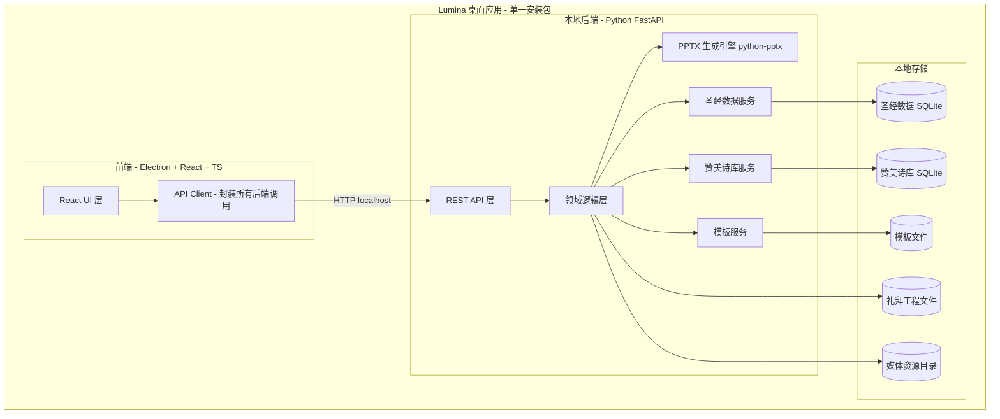
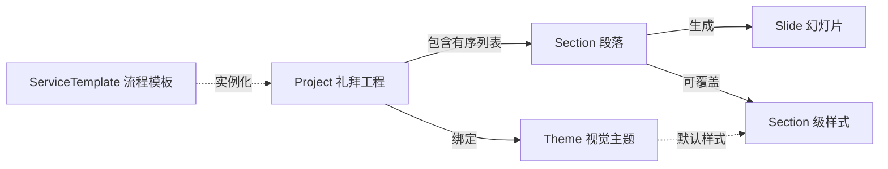

# Lumina 需求文档

> 教会礼拜 PPT 自动生成工具 — 详细需求规格说明
> 文档版本: v1.0 · 用途: 供 coding agent 制定实现 plan

---

## 1. 项目概述

### 1.1 背景与目标
教会每周日礼拜的 PPT 结构高度固定，但每周的启应经文、赞美诗、证道经文、家事报告等内容不同。手工制作礼拜 PPT 重复、费时、易出错。Lumina 旨在通过「固定流程模板 + 内容库（圣经 / 赞美诗） + 自动排版生成」的方式，让同工在几分钟内产出一份排版规范、风格统一的礼拜 PowerPoint 文件。

### 1.2 产品定位
- 一款**离线优先的跨平台桌面应用**。
- 设计原则：**界面简洁、功能恰到好处、上手即用**。面向非技术背景的教会同工。
- 最终产物：一个标准 `.pptx` 文件（可在 PowerPoint / Keynote / WPS 打开放映）。

### 1.3 核心价值
- 内置整本圣经（简体中文和合本），输入经文范围即可自动生成对应 PPT 页。
- 内置常见赞美诗歌词库，一键生成赞美诗 PPT 段落。
- 礼拜流程抽象为可复用的「模板」，每周套用模板后只需填充变化内容。
- 统一主题样式（背景、字体、排版），保证每周 PPT 风格一致。

---

## 2. 目标与非目标

### 2.1 目标 (In Scope)
- 自动生成符合教会固定流程的礼拜 PPT。
- 圣经经文（启应 / 证道）自动按规则排版生成。
- 赞美诗歌词库管理与一键成稿。
- 礼拜流程模板 + 视觉主题模板的创建、维护、套用。
- 段落级（Section）的背景图 / 视频 / 音频 / 字体 / 排版自定义。
- 预览效果（可分期实现）。
- 导出标准 `.pptx`。
- macOS 与 Windows 双平台，UI 与功能完全一致。

### 2.2 非目标 (Out of Scope, v1)
- 在线协作 / 多人实时编辑。
- 云端账号、登录、同步（v1 全本地）。
- 直接放映（presenter mode）；产物交由 PowerPoint 等放映。
- 多语言圣经版本（v1 仅简体中文和合本）；架构上为多版本预留扩展。
- 自动从外部网站抓取赞美诗 / 经文。
- 移动端 / 平板端。

---

## 3. 技术架构

### 3.1 总体架构
纯离线桌面应用，UI 与后端服务分离，但打包在同一安装包内。

### 3.2 技术选型
- **前端**: Electron + React + TypeScript。UI 组件库建议 Ant Design 或 Mantine（成熟、组件全、易做简洁界面）。
- **后端**: Python + FastAPI（提供本地 REST 服务）。
- **PPTX 生成**: `python-pptx`。
- **本地数据**: SQLite（圣经、赞美诗库），文件系统（工程、模板、媒体）。
- **打包**: 后端用 PyInstaller 打包为可执行文件，作为 Electron 子进程随应用启动；Electron 用 electron-builder 产出 macOS (.dmg) 与 Windows (.exe/NSIS) 安装包。

### 3.3 前后端解耦原则
- **后端启动**：Electron 主进程在启动时拉起本地 FastAPI 进程，监听 `127.0.0.1` 上的随机空闲端口；端口通过 IPC 告知渲染进程。仅监听本地回环地址，不对外暴露。
- **稳定契约**：后端对外暴露版本化 REST API（`/api/v1/...`）。所有请求/响应使用明确的 JSON Schema（Pydantic 模型）。
- **解耦要求**：UI 仅依赖 API 契约，不依赖后端内部实现；后端内部重构不应破坏 API。所有后端能力（圣经查询、生成、导出等）均通过 API 暴露，前端不内嵌业务逻辑。
- **健壮性**：统一错误响应格式、输入校验、超时与重试策略（见 §9）。
- **生命周期**：应用退出时优雅关闭后端子进程；后端崩溃时前端可重启之并提示。

---

## 4. 领域模型抽象

这是整个工具的核心。礼拜 PPT 被抽象为「工程（Project）→ 段落（Section）→ 幻灯片（Slide）」三层结构，叠加「主题（Theme）」与「模板（Template）」两套复用机制。

### 4.1 Project（礼拜工程）
一次礼拜的完整工程，是用户的主要工作单元。
- 字段：`id`、`name`（如「2026-06-14 主日崇拜」）、`date`、`themeId`（绑定的视觉主题）、`sections[]`（有序段落列表）、`slideSize`（16:9 / 4:3）、`createdAt`、`updatedAt`、`meta`（牧者、主题经文等备注）。
- 持久化为单一工程文件（建议 `.lumina` 容器：内含 JSON 描述 + 引用的媒体资源；便于备份与迁移）。

### 4.2 Section（段落）
礼拜流程中的一个环节，是内容编排的基本单位。所有 Section 共享基础字段，并按类型携带专属内容。

**基础字段（所有类型共有）**：
- `id`、`type`（见 §4.3）、`category`（见 §4.4）、`title`（段落名，如「启应经文」）、`order`、`enabled`（是否启用/跳过）。
- `style`（段落级样式覆盖，见 §4.6）：背景图/视频/音频、字体、字号、颜色、对齐、边距等；未设置项回退到 Theme。
- `notes`（同工备注，不进入 PPT）。

### 4.3 Section 类型（type）
| type | 中文 | 说明 | 内容模型要点 |
|---|---|---|---|
| `cover` | 封面/标题页 | 礼拜封面、证道题目等大标题页 | `mainTitle`、`subTitle`、可选副信息 |
| `responsive_reading` | 启应经文 | 启/应交替，每节一页 | 圣经引用 + 启应分配规则 |
| `scripture` | 经文展示 | 证道经文，按段展示（非每节一页） | 圣经引用 + 分页策略 |
| `hymn` | 赞美诗 | 标题页 + 歌词页（含回应诗歌、结束诗歌） | 标题/作者 + 歌词分页 |
| `liturgy_text` | 固定礼文 | 使徒信经、主祷文、荣耀颂、祷告等固定文本 | 多段落文本 + 分页策略 |
| `announcement` | 家事报告 | 教会事务公告 | 条目列表或富文本 |
| `media` | 媒体页 | 默祷、阿门颂等以音/视频为主的页 | 媒体引用 + 可选文字 |

> 说明：「起立默祷 + 播放默祷音乐」「播放阿门颂」属于 `media`；「使徒信经/主祷文/荣耀颂/回应祷告」属于 `liturgy_text`；「证道题目」属于 `cover`。

### 4.4 Section 分类（category，用于 UI 归类/筛选/模板库）
`启应经文(responsive)` · `赞美诗(hymn)` · `经文(scripture)` · `礼文(liturgy)` · `媒体(media)` · `其他(other)`。

### 4.5 各类型内容模型详解

#### 4.5.1 responsive_reading（启应经文）
- 输入：圣经引用范围（如 `以西结书 4:1-5`）。
- 生成规则：
  - 范围内**每一节生成一页** PPT。
  - 节按顺序在「启」「应」之间交替分配：主持人读的节标「启」，会众读的节标「应」。
  - 默认：第 1 节为「启」，第 2 节为「应」，依次交替；**起始角色可配置**（启先 / 应先）。
  - 每页结构：顶部或角落显示「启」或「应」标识字 + 该节经文正文 + （可选）节标引用（如「结 4:1」）。
- 字段：`reference`（结构化引用）、`startRole`（qi/ying）、`showVerseNumber`、`showReference`、`labelStyle`（启/应标识的样式与位置）。

#### 4.5.2 scripture（经文展示，证道经文）
- 输入：圣经引用范围（可跨章，如 `约翰福音 3:16-21`）。
- 生成规则：连续展示经文，**按容量分页**（每页可容纳的字数/行数由排版与字号决定），不强制每节一页。
- 字段：`reference`、`showVerseNumber`、`paginationMode`（auto 自动按容量 / manual 手动分页）、`titleSlide`（是否生成经文标题页）。

#### 4.5.3 hymn（赞美诗）
- 来源二选一：
  1. 从内置赞美诗库选取（自动带入标题、作者、歌词与分节）。
  2. 手动输入标题与歌词。
- 生成结构：
  - **标题页**：诗歌名（大字）+ 可选作者/编号。
  - **歌词页**：每页 1–2 句歌词，**顶部大字**显示，便于会众跟唱。分页方式可配置（按句 / 按节 / 手动）。
- 字段：`hymnId?`、`title`、`author?`、`hymnNumber?`、`lyrics`（结构化：段落/句）、`linesPerSlide`、`includeTitleSlide`、`lyricLayout`（对齐、字号、是否显示段标如「副歌」）。
- 编辑能力：可调整断句、合并/拆分歌词页、重排版面。

#### 4.5.4 liturgy_text（固定礼文）
- 内容：多段落文本（使徒信经、主祷文、荣耀颂等）。
- 内置一组**预置礼文**（可被库管理，见 §5.5），也可自定义。
- 分页：按容量自动分页或手动分页。

#### 4.5.5 announcement（家事报告）
- 内容：条目式公告（标题 + 多条事项）或自由富文本。
- 分页：按条目/按容量分页。

#### 4.5.6 cover（封面/标题页）
- `mainTitle`（如证道题目）、`subTitle`、可选经文出处/牧者/日期。

#### 4.5.7 media（媒体页）
- `audioRef?`（本页绑定的音频文件）、`playMode`（`once` 一次 / `loop` 循环）、`videoRef?`（阶段三）、可选 `caption` 文字（如「请起立默祷」）。
- **播放交互（按单击顺序播放 In Click Sequence）**：进入本页先显示文字；第一次点击（正常翻页键/鼠标）**播放绑定音乐**，再次点击才**翻到下一页**。`once` 播放一遍即止；`loop` 循环直到翻页。
- 音频处理见 §6.4.2。

### 4.6 样式与排版模型（Style）
样式分三级，**就近覆盖**：Theme（全局默认） → SectionTypeDefault（主题中按类型的默认） → Section（段落级覆盖）。
- 可设置项：背景（纯色 / 图片 / 视频）、背景音频、主字体与字号、标题字体、文字颜色、对齐方式、行距、边距/安全区、阴影/描边（提升投影可读性）、启/应标识样式。
- `slideSize` 在 Project 级（16:9 默认 / 4:3）。

### 4.7 Theme（视觉主题）
一套全局视觉风格定义：默认背景、配色、字体族、各 Section 类型的默认样式、幻灯片母版风格。可保存、命名、复用、维护（见 §5.6）。

### 4.8 ServiceTemplate（礼拜流程模板）
预置好的**段落序列骨架**（含每段的类型、标题、占位与默认样式），用于「套用模板」快速搭建一次礼拜的结构。
- 内置一个符合 §12 标准流程的默认流程模板。
- 用户可基于现有工程「另存为流程模板」，可维护多套模板（如「主日崇拜」「特别聚会」）。
- 套用模板 = 用模板的段落骨架实例化一个新 Project；之后逐段填充变化内容（经文范围、赞美诗、家事报告等）。

> 模板分两类，互相独立：**ServiceTemplate（流程/结构）** 与 **Theme（视觉/样式）**。一次工程同时引用一个流程来源与一个视觉主题。

---

## 5. 功能需求

### 5.1 工程管理
- 新建工程：从空白 / 从流程模板创建；可设日期、名称、主题。
- 打开 / 保存 / 另存为；最近打开列表。
- **复制工程（Duplicate）**：基于现有工程一键生成一份完整副本（含全部段落、样式、内嵌媒体），作为新工程独立编辑，常用于「以上周礼拜为基础改本周」。副本默认命名加「副本」后缀，深拷贝不与原工程共享数据。
- 工程文件自包含（媒体随工程打包），便于跨机器迁移。
- 自动保存与崩溃恢复。

### 5.2 段落编排
- 段落列表：拖拽排序、增删、启用/禁用（禁用则不进入导出）。
- **复制段落（Duplicate）**：在工程内一键复制任意段落，生成同类型、同内容、同样式的副本并插入到原段落之后；可再拖拽到目标位置。复制为深拷贝（含内容与样式覆盖、引用的媒体）。
- 从「段落库 / 模板」插入预制段落。
- 每个段落进入专属编辑器（按类型不同表单不同）。

### 5.2.1 复制能力总览（通用约定）
复制（Duplicate）作为通用能力贯穿主要实体，统一遵循「深拷贝、生成新 `id`、默认追加「副本」命名、不与源共享数据」的约定：
- **Project**：复制为新工程（§5.1）。
- **Section**：工程内复制段落（§5.2）。
- **ServiceTemplate / Theme**：复制模板或主题为可编辑副本（便于在内置只读项基础上改造，§5.6）。
- **Hymn / LiturgyText**：复制库条目为新条目（便于基于现有诗歌/礼文改词，§5.4 / §5.5）。

### 5.3 圣经经文功能
- **内置整本圣经**：简体中文和合本（CUV），离线 SQLite。
- **引用解析**：支持中文书卷名与常见简称（如「结」=以西结书、「约」=约翰福音）、`书 章:节`、范围 `章:节-节`、跨章范围 `章:节-章:节`、多段（逗号分隔，如 `4:1-5,7`）。
  - 解析需健壮：容错全角/半角冒号与连字符、空格、书卷别名；非法引用给出明确错误。
- **启应生成**：按 §4.5.1 规则自动生成每节一页，启/应交替，起始角色可选。
- **证道经文生成**：按 §4.5.2 规则按容量分页展示。
- 经文预览：在编辑器内即时展示将生成哪些页、每页内容。
- 书卷/章节选择器：除手输引用外，提供下拉/列表选择书卷与章节范围。

### 5.4 赞美诗库
- 内置常见赞美诗歌词库（结构化：标题、作者、编号、分节歌词）。
- 检索：按诗名 / 编号 / 歌词关键字。
- 一键将选中诗歌生成为 hymn 段落（标题页 + 歌词页，按默认分页）。
- 用户可**新增/编辑/复制/删除**库中诗歌（自建词库），与内置库区分但统一检索。复制内置诗歌可得到一份可编辑副本（用于改词/改分节）。
- 手动输入歌词并自定义排版（不入库）也支持。

### 5.5 礼文库
- 内置预置礼文（使徒信经、主祷文、荣耀颂等简体中文标准文本）。
- 可编辑、**复制**、新增自定义礼文，供 `liturgy_text` 段落引用。

### 5.6 模板与主题管理
- **流程模板**：内置默认主日崇拜流程；支持新建、编辑、**复制**、删除、从工程另存为、套用。
- **视觉主题**：内置至少 1–2 套美观主题；支持自定义、**复制**、保存、复用、设为默认。
- **段落样式模板**（可选增强）：保存单个段落的样式以便复用。
- 内置只读项不可直接改写，可通过「复制」生成可编辑副本后修改。

### 5.7 媒体管理
- 为段落设置背景图、背景视频（阶段三）。
- **按页绑定播放音乐**：在 `media` 页（及任意需要的页）可选择一个音频文件，并设置**播放模式（一次 / 循环）**；放映时按单击顺序播放（见 §4.5.7）。
- 媒体导入后纳入工程资源目录，音频随 pptx 内嵌，导出按 §6.4 处理。
- 支持常见格式（图片 jpg/png；音频 mp3/wav；视频 mp4，阶段三）。

### 5.8 预览
- **段落预览**：编辑时实时预览当前段落生成的幻灯片缩略图。
- **整体预览**：以幻灯片缩略图序列预览整份 PPT。
- 实现策略（分期）：
  - v1：前端用 HTML/CSS 按主题样式渲染「近似预览」（所见接近所得）。
  - v2（可选）：后端渲染真实 PPTX 页面为图片返回，保证高保真。
  - 若高保真预览实现成本高，可后置；v1 至少提供结构与内容预览。

### 5.9 导出
- 一键导出 `.pptx` 到用户选定路径。
- 导出前校验：未填写的占位、非法经文引用、缺失媒体等给出汇总提示。
- 导出选项：幻灯片尺寸、是否嵌入媒体、是否包含禁用段落（默认否）。

---

## 6. PPTX 生成引擎需求

### 6.1 生成流程
`Project → 遍历启用 Section → 各 Section 按类型展开为 Slide 列表 → python-pptx 写入 → 保存 .pptx`。

### 6.2 母版与版式
- 建立与 Theme 对应的 Slide Master / Layout，统一背景、字体、占位框，确保风格一致与可维护。
- 文字可读性：投影场景下默认大字号、高对比、可加描边/阴影。

### 6.3 各类型 → 幻灯片映射
- `cover` → 1 页标题版式。
- `responsive_reading` → N 页，每页含启/应标识 + 单节经文（+可选节引用）。
- `scripture` → 按容量 M 页（+可选标题页）。
- `hymn` → 1 标题页 + K 歌词页。
- `liturgy_text` / `announcement` → 按容量分页。
- `media` → 1 页背景媒体 + 可选文字。

### 6.4 媒体嵌入

#### 6.4.1 图片
直接嵌入，无特殊风险。

#### 6.4.2 音频（强需求 — 按单击顺序播放，非自动播放）
礼拜流程依赖音频（默祷音乐、阿门颂等）。**交互明确为「按单击顺序播放」（In Click Sequence），不需要自动播放**：进入媒体页先显示文字，第一次单击播放该页绑定的音乐，再次单击才翻页；播放模式支持**一次 / 循环**。需在阶段二落地。`python-pptx` 无原生音频 API，但音频与视频在 PowerPoint 中共用媒体机制，可程序化实现。采用以下方案：

- **嵌入与 MIME 注册（两方案共用）**：
  1. 用 `shapes.add_movie(audio_file, ..., mime_type='audio/mp3')` 将音频作为媒体对象嵌入（python-pptx 官方说明的 off-label 用法，稳定可用）。
  2. 注册音频 MIME 为 `MediaPart`（至少 `audio/mp3`、`audio/mpeg`、`audio/x-wav`），否则重新打开 pptx 会因 content-type 未注册而报错。
  3. 隐藏音频图标：移出画面安全区 / 缩至极小 / 置于背景之后（放映时用正常翻页键触发，无需点击图标）。
- **方案 B（推荐主方案，最高保真）— 模板幻灯片 + 媒体字节替换**：预先在 PowerPoint 中手工制作两张媒体页模板，分别配置好「按单击顺序播放·一次」与「按单击顺序播放·循环」（timing XML 由 PowerPoint 生成，兼容性最强、最稳定）；导出时克隆对应模板页并替换内嵌音频字节与关系（rId）。强烈推荐作为主实现路径——「按单击顺序播放」的 timing 结构较繁琐，由 PowerPoint 生成可规避手写错误。
- **方案 A（备选，纯程序化）— `add_movie` + OOXML timing 注入**：用 lxml 在幻灯片 `<p:timing>` 中注入一条**主序列单击触发**步骤（`<p:par>` 内 on-click `<p:cond delay="0"/>` 包裹 `<p:cMediaNode>`），使媒体成为单击序列的一步（点击播放、下一次点击翻页）；循环模式在对应 `<p:cTn>` 设 `repeatCount="indefinite"`。多媒体页需按 `spid` 精确定位各自 timing 节点。
- **格式与兼容性**：优先支持 **mp3 / wav**（PowerPoint macOS/Windows、WPS 兼容性最好），m4a 等不作兼容保证。音频随 pptx **内嵌**（便于携带，不外链）。
- **验收**：导出文件在 macOS 与 Windows 版 PowerPoint 中放映时，媒体页第一次单击播放绑定音乐、再次单击翻页；`once` 播一遍即止，`loop` 循环至翻页。

#### 6.4.3 视频（阶段三）
视频嵌入与自动播放沿用与音频相同的机制（`add_movie` 原生即面向视频 + timing 注入），但实现与兼容性验证成本更高，置于阶段三。

### 6.5 分页算法
- 文本按容量分页需要估算每页可容纳字数/行数（依据字号、行距、文本框尺寸、中文字宽）。提供「自动分页 + 手动微调」两种模式。

---

## 7. 数据模型与持久化

### 7.1 圣经数据
- SQLite 表：`books(id, name, short_names, order, chapter_count)`、`verses(book_id, chapter, verse, text)`。
- 版本：简体中文和合本（CUV，1919，公有领域文本）。
- 数据来源需在实现阶段确认为可合法使用的开源/公有领域语料，并校验完整性（66 卷、章节数正确）。

### 7.2 赞美诗库
- SQLite 表：`hymns(id, title, author, number, source, builtin)`、`hymn_sections(hymn_id, order, label, text)`。
- 内置库与用户自建库共存（`builtin` 标记），统一检索。
- 注意版权：内置歌词应优先选用公有领域 / 可合法分发的资源；其余由用户自行录入（见 §11）。

### 7.3 工程文件（.lumina）
- 容器内：`project.json`（结构 + 样式 + 内容引用）+ `media/`（引用的媒体副本）+ 版本号。
- 设计为向前兼容（含 schema 版本，便于升级迁移）。

### 7.4 模板与主题文件
- 流程模板、视觉主题各以 JSON 持久化于应用数据目录，附带内置只读集合与用户可写集合。

---

## 8. 后端 API 设计（契约草案）

统一前缀 `/api/v1`。所有响应含统一信封：`{ "data": ..., "error": null }` 或 `{ "data": null, "error": { "code", "message", "details" } }`。

### 8.1 健康/系统
- `GET /api/v1/health` — 后端就绪探测（前端启动时轮询）。
- `GET /api/v1/version` — 版本与能力信息。

### 8.2 圣经
- `GET /api/v1/bible/books` — 书卷列表（名称、简称、章数）。
- `GET /api/v1/bible/passage?ref=以西结书4:1-5` — 解析引用并返回结构化经节数组。
- `POST /api/v1/bible/parse-ref` — 校验/解析引用，返回规范化结构或错误。

### 8.3 赞美诗 / 礼文
- `GET /api/v1/hymns?query=` — 检索。
- `GET /api/v1/hymns/{id}` — 详情（含分节歌词）。
- `POST /PUT/DELETE /api/v1/hymns/{id}` — 用户词库增删改。
- `POST /api/v1/hymns/{id}/duplicate` — 复制为可编辑副本（含内置项）。
- `GET/POST/PUT/DELETE /api/v1/liturgy-texts` — 礼文库管理。
- `POST /api/v1/liturgy-texts/{id}/duplicate` — 复制礼文。

### 8.4 工程
- `POST /api/v1/projects` — 新建（可指定流程模板）。
- `GET /api/v1/projects/{id}` / `PUT` / `DELETE`。
- `POST /api/v1/projects/{id}/duplicate` — 复制整份工程为新工程（深拷贝，含内嵌媒体）。
- `POST /api/v1/projects/open`、`POST /api/v1/projects/{id}/save`、`/save-as`。
- 段落操作：`POST/PUT/DELETE /api/v1/projects/{id}/sections`，含排序。
- `POST /api/v1/projects/{id}/sections/{sectionId}/duplicate` — 工程内复制段落（深拷贝，插入到源段落之后，可带目标位置）。

### 8.5 模板 / 主题
- `GET/POST/PUT/DELETE /api/v1/service-templates`。
- `POST /api/v1/service-templates/{id}/duplicate` — 复制流程模板为副本。
- `GET/POST/PUT/DELETE /api/v1/themes`。
- `POST /api/v1/themes/{id}/duplicate` — 复制视觉主题为副本。

> 复制（duplicate）统一约定：深拷贝、服务端生成新 `id`、默认名称追加「副本」、与源不共享数据；内置只读项可被复制为用户可写副本。

### 8.6 媒体
- `POST /api/v1/projects/{id}/media` — 上传/导入媒体到工程。

### 8.7 预览 / 生成
- `POST /api/v1/projects/{id}/preview` — 返回段落/整体预览数据（v1 结构化；v2 可返回渲染图片）。
- `POST /api/v1/projects/{id}/export` — 生成 `.pptx`，返回文件路径/下载流；支持导出选项。

> 所有写操作均做 Pydantic 校验；引用解析、生成、导出等耗时操作返回明确进度或同步结果，并有超时保护。

---

## 9. 非功能需求

- **离线**：全部功能不依赖网络。
- **跨平台一致**：macOS 与 Windows 的 UI、交互、功能、产物完全一致。
- **性能**：生成一份典型礼拜 PPT（约 40–80 页含若干媒体）应在数秒内完成；圣经查询与预览近实时。
- **健壮性**：
  - 统一错误码与友好中文错误信息。
  - 后端输入校验、超时、（必要时）重试。
  - 后端进程崩溃可被前端检测并自动重启。
- **可用性 / UI**：界面简洁、流程清晰，关键路径（套模板 → 填经文/诗歌 → 导出）最少步骤完成。
- **可维护性**：API 版本化；领域逻辑与生成引擎、数据访问分层解耦。
- **数据安全**：本地数据，定期自动保存与崩溃恢复；工程文件可备份迁移。
- **国际化**：UI v1 简体中文；架构预留多语言与多圣经版本扩展点。
- **打包体积/启动**：合理控制安装包体积（圣经/词库 SQLite 内置），启动时快速拉起后端。

---

## 10. UI / UX 设计要点

- **主界面布局**：左侧段落大纲（可拖拽排序）+ 中部段落编辑器 + 右侧预览缩略图。
- **新建向导**：选择流程模板 → 选择视觉主题 → 设置日期/名称 → 进入编辑。
- **段落编辑器**：按类型呈现差异化表单（经文引用输入框、赞美诗检索、礼文选择、媒体选择、样式面板）。
- **样式面板**：背景/字体/字号/颜色/对齐/边距等，含「应用到本段 / 设为本类型默认」。
- **经文输入**：支持手输引用 + 书卷章节选择器，输入即预览生成结果。
- **赞美诗**：搜索框 + 结果列表 + 一键插入 + 歌词分页可视化微调。
- **导出**：明显的「导出 PPTX」按钮 + 导出前校验提示。
- 一致性：两平台采用同一套 React 组件与样式，避免平台特异性 UI。

---

## 11. 风险与假设

- **风险 1 — 媒体播放控制**：python-pptx 无原生音视频 API，播放触发需操作 OOXML `<p:timing>`。**音频为强需求**，交互为「按单击顺序播放（点击播放/再点击翻页）+ 一次/循环」，已确定技术路线（§6.4.2，推荐方案 B 模板替换为主、方案 A 程序化注入为备选），需在阶段二完成可行性验证与落地，重点验证「单击触发播放、下一次单击翻页」与「循环至翻页」；视频沿用同机制，置于阶段三。
- **风险 2 — 圣经语料合法性与质量**：需确认采用公有领域/可分发的简体和合本语料，并校验完整与准确（书卷、章节、节数、文本）。
- **风险 3 — 赞美诗版权**：现代赞美诗歌词可能有版权。内置库优先收录公有领域内容；其余以「用户自行录入」为主，文档与界面应提示版权责任。
- **风险 4 — 高保真预览**：真实 PPTX 渲染预览成本高，v1 采用近似预览，高保真后置。
- **风险 5 — 中文文本分页估算**：按容量分页需较准确的中文排版度量，需调参与手动微调兜底。
- **假设**：用户机器可运行打包后的 Python 子进程；目标 Office 版本支持所生成 pptx 的特性。

---

## 12. 标准礼拜流程（默认流程模板内容）

默认 ServiceTemplate 的段落顺序（对应 §4.3 类型）：

1. 礼拜开始 / 起立默祷（`media`：默祷音乐 + 「请起立默祷」文字）
2. 启应经文（`responsive_reading`，每周变化）
3. 使徒信经（`liturgy_text`，固定）
4. 赞美诗 ×3–4（`hymn`，每周变化）
5. 祷告（`liturgy_text` 或 `media`）
6. 荣耀颂（`liturgy_text`，固定）
7. 证道经文（`scripture`，每周变化）
8. 证道题目（`cover`，每周变化）
9. 回应祷告（`liturgy_text`）
10. 回应诗歌（`hymn`，每周变化）
11. 家事报告（`announcement`，每周变化）
12. 结束诗歌（`hymn`，每周变化）
13. 主祷文（`liturgy_text`，固定）
14. 阿门颂（`media`：播放阿门颂）
15. 礼拜结束

> 该流程作为内置默认模板；用户可增删段落、调整顺序、另存为新流程模板。

---

## 13. 建议实现分期（供 plan 参考，非强约束）

- **阶段一（核心闭环）**：领域模型 + 后端 API 骨架 + 圣经数据导入与引用解析 + 启应/证道经文生成 + 基础 PPTX 导出 + 最简编辑 UI + 默认流程模板。
- **阶段二（内容库与模板）**：赞美诗库 + 礼文库 + 视觉主题 + 流程模板管理 + 样式面板 + 近似预览 + **音频按页绑定与按单击顺序播放（一次/循环，强需求，§6.4.2）**。
- **阶段三（增强）**：视频嵌入与播放、高保真预览、自动保存/崩溃恢复、打包与双平台发布。

> 注：媒体能力中，**图片**贯穿阶段一，**音频**为强需求置于阶段二（含早期可行性验证），**视频**置于阶段三。
